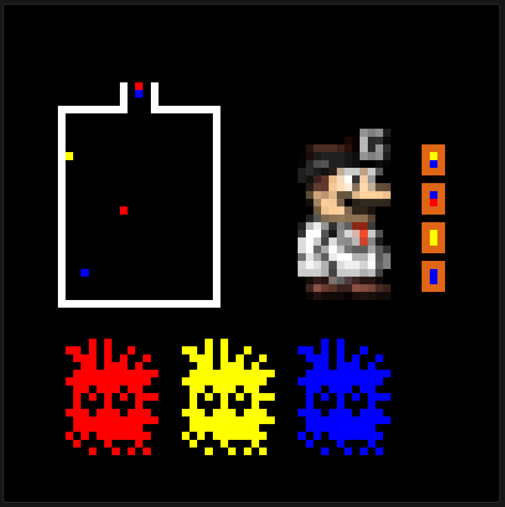

# CSC258 Project: Dr. Mario

## **Game Summary:**
• Run drmario.asm, click on bitmap for assembly to access the keyboard so that you can play\
• Keys: a left, s down, d right, w turns right, e turns left, q quits, p pauses/unpauses\
• If ’GAME OVER’, press r to restart game or q to quit.

